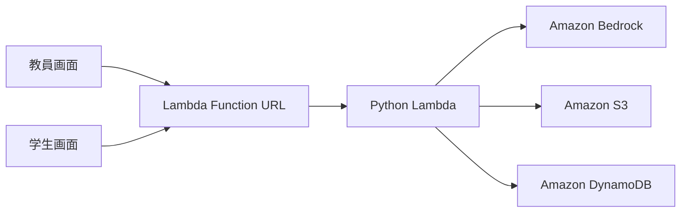

# Lecture Feedback / Quiz Generator

講義テキストまたはPDFから4択小テストを生成し、学生の回答を採点・集計して、講義改善のための分析を生成するAWS上のMVPです。

## 画面構成

1つのAmplifyアプリ内で、用途ごとに画面を分けています。ログインや権限管理は使用しません。

| URL | 用途 |
| --- | --- |
| `/index.html` | 教員用・学生用画面を選ぶ入口 |
| `/teacher.html` | 教材入力、小テスト生成、学生用URL共有、回答分析 |
| `/student.html?quiz_id=...` | 小テスト取得、回答送信、個人の採点結果表示 |

教員が小テストを生成すると、`quiz_id`を含む学生用URLが自動作成されます。学生は共有URLを開くだけで対象の小テストを読み込めます。

## システム構成



- フロントエンド：AWS Amplify Hosting
- API：AWS Lambda Function URL
- 実行処理：Python Lambda
- 生成AI：Amazon Bedrock Converse API
- PDFテキスト抽出：`pypdf`（OCRではありません）
- 保存先：Amazon S3、Amazon DynamoDB

Amplifyが配信するのは`frontend/`の静的ファイルです。Lambda、S3、DynamoDB、Bedrockは既存のAWSバックエンドをそのまま使用します。

## ディレクトリ

| パス | 用途 |
| --- | --- |
| `frontend/index.html` | 入口画面 |
| `frontend/teacher.html` | 教員用画面 |
| `frontend/student.html` | 学生用画面 |
| `frontend/css/style.css` | 全画面共通のデザイン |
| `frontend/js/config.js` | Lambda Function URLなどのフロントエンド設定 |
| `frontend/js/api.js` | API呼び出しなどの共通処理 |
| `frontend/js/teacher.js` | 小テスト生成、URL共有、回答分析 |
| `frontend/js/student.js` | 小テスト取得、回答、採点表示 |
| `backend/lambda_function.py` | Lambda本体 |
| `infra/template.yaml` | AWS SAMテンプレート |
| `docs/` | API、構成、操作、デプロイ手順 |
| `tests/` | AWSへ接続しない単体テスト |
| `amplify.yml` | Amplifyのビルド設定 |

## 教員の操作

1. 入口画面で「教員用」を選ぶ。
2. 講義タイトル、問題数、テキストまたはPDFを入力する。
3. 「小テストを生成」を押す。
4. 問題、正解、解説を確認する。
5. 学生用URLをコピーして学生へ共有する。
6. 回答後に「結果を取得・更新」を押して、正答率とAI分析を確認する。

## 学生の操作

1. 教員から共有されたURLを開く。
2. 学生IDと任意の名前を入力する。
3. すべての問題に回答して送信する。
4. 得点、正解、解説を確認する。

同じ`student_id`で再送信すると、DynamoDB上の回答は最新の内容で上書きされます。

## ローカル確認

リポジトリのルートで次を実行します。

```bash
python3 -m http.server 8000 --directory frontend
```

ブラウザで`http://localhost:8000`を開きます。APIを実行する場合は、Lambda Function URLのCORSでローカルOriginを許可する必要があります。

## 設定

Lambda Function URLを変更する場合は、`frontend/js/config.js`の`API_URL`だけを変更します。

```javascript
window.APP_CONFIG = Object.freeze({
  API_URL: "https://example.lambda-url.ap-northeast-1.on.aws/",
  MAX_PDF_BYTES: 5 * 1024 * 1024,
  REQUEST_TIMEOUT_MS: 330000
});
```

## テスト

```bash
python3 -m unittest discover -s tests -v
```

JavaScriptの構文確認にはNode.jsを使用できます。

```bash
node --check frontend/js/api.js
node --check frontend/js/teacher.js
node --check frontend/js/student.js
```

## デプロイ

`main`ブランチへ変更を反映すると、Amplifyが`amplify.yml`を使って`frontend/`全体を自動デプロイします。今回の画面分割ではバックエンドの変更はありません。

詳しい手順は以下を参照してください。

- [画面と操作](docs/UI_GUIDE.md)
- [Amplifyへの反映](docs/DEPLOY_AMPLIFY.md)
- [この変更をGitHubへ適用する方法](docs/APPLY_CHANGES.md)
- [API仕様](docs/API_SPEC.md)

## 注意

- ログインや権限管理を行わない、講義内利用向けの簡易実装です。
- Lambda Function URLはブラウザから確認できます。URL自体を秘密情報として扱うことはできません。
- 実在する学生の情報や機密資料を使う場合は、公開範囲とデータの扱いを別途確認してください。
- PDF処理は文字抽出のみです。スキャン画像だけのPDFに対するOCRは実装していません。
