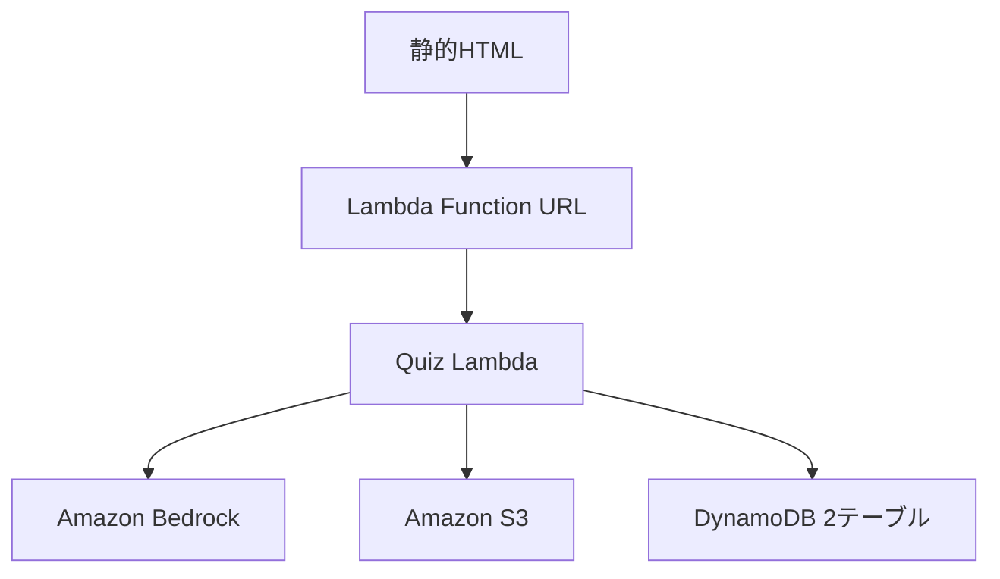

# 現行実装の解析結果

## 概要

`demo.html` と単一のPython Lambdaで構成された、講義用クイズ生成・採点・結果分析MVPです。Lambdaは `action` フィールドで6処理を切り替えます。

| action | 役割 |
| --- | --- |
| `generate_quiz` | テキストからクイズを生成 |
| `upload_pdf_and_generate_quiz` | Base64 PDFをS3へ保存し、クイズを生成 |
| `generate_quiz_from_pdf` | 既存S3オブジェクトからクイズを生成 |
| `get_quiz` | 正解を除外した学生向けクイズを取得 |
| `submit_answer` | 回答を採点し、DynamoDBへ保存 |
| `get_results` | 統計を集計し、Bedrockで講義改善分析を生成 |

## データフロー

## 確認できた実装上の特徴

- Bedrock出力からJSON部分を抽出し、4択・正解番号を検証している。
- 学生向け取得時は正解と解説を返していない。
- PDF本文にはページ番号を付与してからモデルへ渡す。
- PDFは最大5 MiBとしているが、Base64化による増加分は別途考慮が必要。
- PDF本文は既定で先頭12,000文字、ブラウザ版では8,000文字に切り詰める。
- PDF処理は `pypdf` の文字抽出であり、スキャンPDFのOCRは実装されていない。
- クイズ本体と回答を別のDynamoDBテーブルへ保存する。
- 元テキストとPDFをS3へ保存する。
- 結果分析は取得のたびにBedrockを呼び出し、キャッシュしていない。

## 再現性

元ディレクトリだけではAWS環境全体を再現できません。Lambdaコードには環境変数名だけがあり、次の情報はAWS側にあります。

- DynamoDBのテーブル定義
- S3バケット設定
- Lambdaランタイム、メモリ、タイムアウト
- IAM実行ロール
- Bedrock inference profile
- Function URLの認証・CORS
- CloudWatchログ保持期間

本配布物では、コードから推定できる最小構成を `infra/template.yaml` と `docs/AWS_REQUIREMENTS.md` に明文化しています。

## コード一致確認

提供された `lambda_function.py` と、提供された `function.zip` 内の `lambda_function.py` はSHA-256で一致しています。そのため、手元コードと提供済みデプロイパッケージの間にコード差分はありません。

