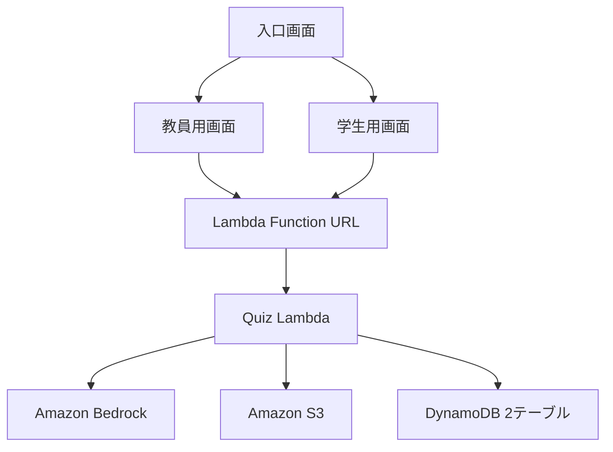

# アーキテクチャ

## 概要

講義テキストまたはPDFからクイズを生成し、回答の採点・集計と講義改善分析を行うMVPです。フロントエンドはAmplify Hosting、バックエンドは1つのPython Lambdaで構成されています。

LambdaはJSONの`action`フィールドで処理を切り替えます。

| `action` | 役割 | 主なAWSサービス |
| --- | --- | --- |
| `generate_quiz` | テキストからクイズを生成 | Bedrock、S3、DynamoDB |
| `upload_pdf_and_generate_quiz` | Base64 PDFを保存してクイズを生成 | S3、Bedrock、DynamoDB |
| `generate_quiz_from_pdf` | 既存S3 PDFからクイズを生成 | S3、Bedrock、DynamoDB |
| `get_quiz` | 正解を除いた学生向けクイズを取得 | DynamoDB |
| `submit_answer` | 回答を採点して保存 | DynamoDB |
| `get_results` | 統計と講義改善分析を生成 | DynamoDB、Bedrock |

## データフロー

## 保存データ

### S3

- `lecture_texts/`: 入力された講義テキスト
- `pdfs/browser-upload/`: ブラウザからアップロードされたPDF

### DynamoDB

- クイズテーブル: `quiz_id`をキーに問題、正解、解説、作成日時を保存
- 回答テーブル: `quiz_id`と`student_id`をキーに回答、点数、提出日時を保存

## 実装上の制約

- PDFは`pypdf`で文字を抽出するため、画像だけのスキャンPDFには対応しない。
- ブラウザからのPDF送信はBase64方式であり、大きいファイルには適さない。
- PDF本文は指定された`max_chars`で切り詰めてからBedrockへ送る。
- 結果分析は取得のたびにBedrockを呼び出し、キャッシュしていない。
- 教員用・学生用の表示は分離しているが、講義内MVPのためログインや権限管理は行わない。
- Lambda Function URLは認証なしで、CORSはAmplify Originに限定する。
- `backend/`をGitHubへpushしても、既存Lambdaは自動更新されない。

## 次段階の改善候補

1. S3 presigned URLによるPDFアップロード
2. 許可されたS3 prefixの検証
3. 結果分析のキャッシュ
4. Textract等によるOCR
5. LambdaバックエンドのCI/CD
