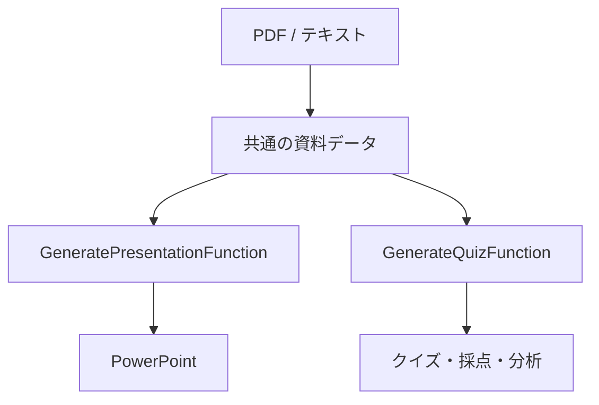

# プレゼンテーションアプリへの統合方針

## 推奨構成

既存のプレゼンテーション生成Lambdaへクイズ処理を混在させず、`GenerateQuizFunction` として分離します。

## 最初の統合（短期間）

1. チーム側UIに「同じ資料からクイズを生成」を追加する。
2. 既存クイズLambdaへ、PDFのBase64またはテキストを送る。
3. 返却された `quiz_id` をプレゼンテーション作成セッションと関連付ける。
4. クイズ、回答、結果分析を別タブで表示する。

この方法は変更量が少ない一方、PDFを二重に送る可能性があります。

## 推奨統合（次段階）

1. プレゼンテーション側でPDFを1回だけS3へ保存する。
2. `document_id` と、アクセスを制限したS3キーを発行する。
3. プレゼンテーションLambdaとクイズLambdaが同じ資料を参照する。
4. PDFテキスト抽出結果も共通化する。
5. クイズにはPDFページ番号または対応スライド番号を保持する。

## 移植時に変更する箇所

- `PDF_BUCKET` をチーム側Amplify Storageへ変更
- DynamoDBをAmplify Dataまたは専用テーブルとして定義
- `BEDROCK_PROFILE_ID` をAmplifyのsecret / environment configurationで注入
- Lambda IAMにStorage、Data、Bedrock権限を付与
- Cognitoユーザーと `student_id` を結び付ける
- 教員だけが `get_results` を実行できるよう認可する
- スキャンPDFを扱うならTextract等のOCRを追加

## 共有すべき成果物

- このリポジトリ一式
- AWS構成コード
- API仕様
- サンプルevent/response
- 使用Bedrock model/profileの名称
- CORS・認証方針
- データ保存期間と削除方針

単独のAmplify URLは動作確認には有効ですが、コード統合にはこのソース一式が必要です。

